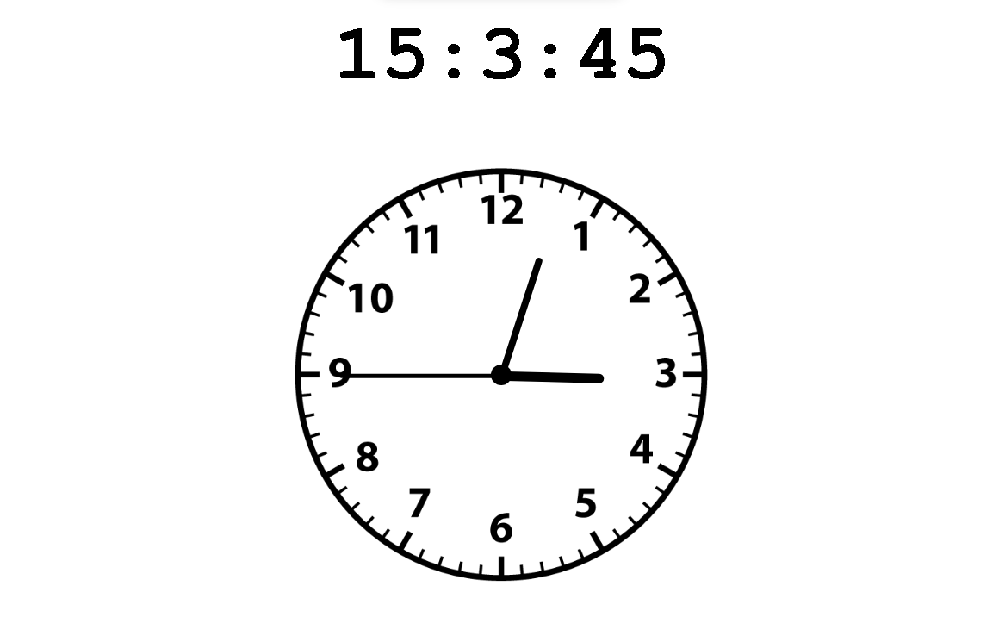

# The Clock using HTML, CSS and Javascript

## Preview


## How to make one :

- ### Download a Clock Image.
- ### Create Clock Hands with CSS.
- ### Get Current Time with JavaScript.
  ```
  d = new Date();
  htime = d.getHours();
  time = d.getMinutes();
  stime = d.getSeconds;
  ```
- ### Calculate Hand Angles.
  ```
  hrot = 30 * htime + mtime / 2;
  mrot = 6 * mtime;
  srot = 6 * stime;
  ```
- ### Rotate Clock Hands with JavaScript DOM.
  ```
  hour.style.transform= `rotate(${hrot}deg)`
  minute.style.transform= `rotate(${mrot}deg)`
  second.style.transform = `rotate(${srot}deg)`;
  ```
- ### Update the Clock Every Second.
  ```
  setInterval(() => {
  //The content
  }, 1000);
  ```
